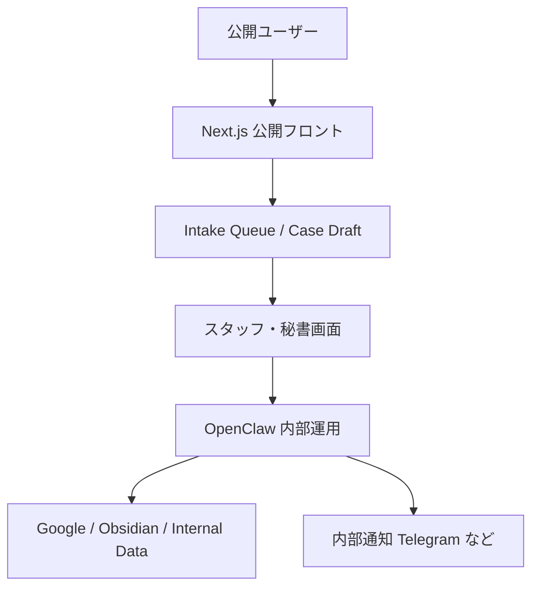

# Public Intake / Security Plan

Date: 2026-04-05

## Goal

このプロダクトは、既存の「ご意見を受け付けました」という自動返信を置き換えるだけでは弱い。
目指す価値は次の 3 点。

- 市民の声を対話で整理し、案件化する
- 相談者に「どう扱われているか」を必要十分に見せる
- 政治家・秘書の負担とセキュリティ事故を増やさない

## Problem

既存のメール窓口は、受領確認は返せても、その後の進み方が見えにくい。
一方で、公開ユーザーに自由な命令権を与えて OpenClaw や Google 連携へ直結すると、セキュリティ上かなり危険。

したがって、公開面の価値は「内部ツールを触れること」ではなく、次の 2 つで作る。

- 対話による論点整理
- 案件処理状況の限定的な可視化

## Product Principle

- 公開ユーザーは「相談できる」が「内部ツールを命令できない」
- OpenClaw は内部専用で運用する
- 副作用のある操作は、スタッフ承認または定期バッチ経由でのみ行う
- 公開ステータスは自動更新を基本にし、秘書が毎回手入力しなくてよい設計にする
- 公開画面には、安心感は出すが、内部メモ・担当者・予定・連絡先は出さない

## Overall Diagram



## Public vs Internal Boundary

### 公開フロントでできること

- 意見、要望、困りごとの投稿
- 追加ヒアリングへの回答
- AI による要点整理の確認
- 自分の案件の公開ステータス確認
- 必要に応じた追加資料の再提出

### 公開フロントでできないこと

- Gmail の閲覧
- Google Calendar / Tasks の閲覧
- Obsidian / 内部メモへの直接書き込み
- Telegram / Discord 通知の送信
- OpenClaw の任意コマンド実行
- 他人の案件の閲覧

### 内部専用で扱うもの

- Google 連携
- 予定・タスク・経費・公開情報の同期
- 案件同士の関連付け
- 内部向け通知
- 内部メモ更新
- 対応方針の判断

## User Experience Difference

### 既存の自動返信

```text
メール送信
  -> 受け付けました
  -> その後は見えにくい
```

### このプロダクト

```text
相談入力
  -> AI が要点整理
  -> 案件ドラフト化
  -> 公開ステータス付与
  -> 必要に応じて追加質問
  -> 内部確認
  -> 結果や進行状況を限定公開
```

## Public Status Design

公開ユーザーに見せるべきなのは「内部の生々しい運用」ではなく、「無視されていない」と分かる最小限の進行状況。

### 推奨ステータス

1. `受付済み`
   相談を受け付け、内容の整理を開始した段階。

2. `確認中`
   内容の重複確認、分類、補足情報の要否を見ている段階。

3. `追加情報待ち`
   ユーザーに追加の事実確認や資料提出をお願いしている段階。

4. `内部検討中`
   秘書または関係者が内部で確認している段階。

5. `関連情報を確認済み`
   公開情報や既存案件との関係を整理できた段階。

6. `対応方針を整理中`
   どの窓口・どの手段で扱うべきかを絞っている段階。

7. `回答・案内済み`
   相談者へ案内または一次回答を返した段階。

8. `完了`
   その案件単位での一次処理が終了した段階。

### 公開しないもの

- 誰が担当しているか
- いつ会議するか
- 内部メモ全文
- 関係者の名前
- Gmail / カレンダーの内容
- 党内調整や政治判断の途中経過

## Burden-Saving Design

政治家・秘書の負担を増やさないため、公開ステータスは手動更新を前提にしない。

### 基本ルール

- ステータス更新はイベント駆動で自動化する
- 人手が必要なのは「判断」と「例外対応」に寄せる
- 公開メッセージはテンプレートを使い、毎回文面を考えなくてよいようにする

### 自動更新の例

- 投稿を受信したら `受付済み`
- AI が要点整理を終えたら `確認中`
- 追加質問を送ったら `追加情報待ち`
- スタッフ画面でレビュー開始したら `内部検討中`
- 公開情報や既存案件のリンク付けが済んだら `関連情報を確認済み`
- 返信テンプレートを送ったら `回答・案内済み`
- クローズ操作で `完了`

### 負担を増やさない工夫

- ステータス文言は短く固定する
- 更新履歴は自動で残す
- すべての案件を常に詳細確認しなくてよいよう、優先度順に並べる
- 通知は即時連打ではなく、ダイジェスト中心にする
- 同種案件はまとめて扱い、個別返信の負荷を下げる

## Security Design

### 1. 公開面と内部面を分ける

- `frontend` は公開窓口
- OpenClaw は内部運用
- 直結させず、承認済み API またはジョブ経由でつなぐ

### 2. 権限を分ける

- `public`: 投稿、閲覧、自分の案件確認のみ
- `staff`: 案件レビュー、公開ステータス変更、返信送信
- `admin`: OpenClaw 実行、通知設定、Google 連携設定

### 3. LLM に自由な実行権を与えない

- ユーザー入力をそのままツール実行に変換しない
- 実行可能な操作は server 側の allowlist で固定する
- Gmail、Calendar、Tasks、通知は直接 function calling させない

### 4. 秘密情報は公開アプリに置かない

- Google 系 Secrets は GitHub Actions または private worker のみ保持
- 公開フロントのブラウザには API key / refresh token を出さない
- `.github/workflows/` と Secrets はリポジトリ本体とは別管理でよい

### 5. 可視化は「案件の箱」単位で行う

- 公開ユーザーに見せるのは「案件状態」
- 見せないのは「内部作業の詳細」
- これにより透明性と安全性を両立する

## Recommended Data Model

```text
PublicCase
- public_case_id
- intake_channel
- title
- summary
- theme_tags
- area
- status_public
- status_internal
- latest_public_message
- requires_user_input
- created_at
- updated_at
- last_public_update_at
```

### `status_public` と `status_internal` を分ける理由

- 内部では細かく管理したい
- 公開側にはシンプルに見せたい
- 内部の検討内容をそのまま公開しなくて済む

## Public Timeline Example

```text
4/5 受付済み
  ご相談を受け付けました。内容を整理しています。

4/5 確認中
  ご相談内容を分類し、必要に応じて追加確認事項を整理しています。

4/6 追加情報待ち
  場所と日時が分かると、より具体的に確認できます。

4/7 内部検討中
  いただいた内容をもとに内部で確認しています。

4/9 回答案内済み
  現時点で確認できた案内をお届けしました。
```

## Why This Is Better Than Auto-Reply

- 受け付けただけで終わらない
- 市民が「今どうなっているか」を確認できる
- 相談が案件として残る
- 類似案件と束ねられる
- 公開情報と接続できる
- ただし内部権限は開かないので安全性を落としにくい

## Implementation Phasing

### Phase 1

- 公開相談フォーム
- AI 要点整理
- 案件ドラフト保存
- 公開ステータス 3 段階
  - `受付済み`
  - `確認中`
  - `回答・案内済み`

### Phase 2

- 追加質問フロー
- 類似案件の束ね
- 公開情報との関連表示
- スタッフ画面でのレビュー運用

### Phase 3

- OpenClaw と内部ジョブの連携
- 自動ダイジェスト通知
- 優先度付けと例外検知
- ステータス自動更新の拡張

## Immediate Recommendation

最初の実装では、やりすぎない方がよい。
まずは次の形が妥当。

- 公開ユーザーは相談を送る
- AI が要点整理して案件ドラフト化する
- 公開ステータスだけ見える
- 内部処理はスタッフが確認してから OpenClaw に渡す
- Google 連携と通知は引き続き内部専用のままにする

これなら、既存の自動返信より一歩進みつつ、政治家・秘書の負担とセキュリティリスクを抑えやすい。
